## Was wir im Labor gemacht haben
Im E-Technik-Labor haben wir von Johannes einen Schnelldurchgang durch die elektrotechnischen Grundlagen bekommen, die wir für unser Projekt benötigen (könnten). Dazu gehört das theoretische Wissen, dass wir in der Vorlesung am Anfang bekommen haben, als auch die praktische Anwendung im Labor danach. Während der Vorlesung hat Johannes einen Multimeter in die Runde gegeben und paarweise abgefragt wo wir für welche Funktion die Scheibe drehen müssen und welche Stecker wir unten verwenden müssen. In der Abbildung sieht man so einen Multimeter, der so eingestellt ist um die Stromspannung messen zu können.
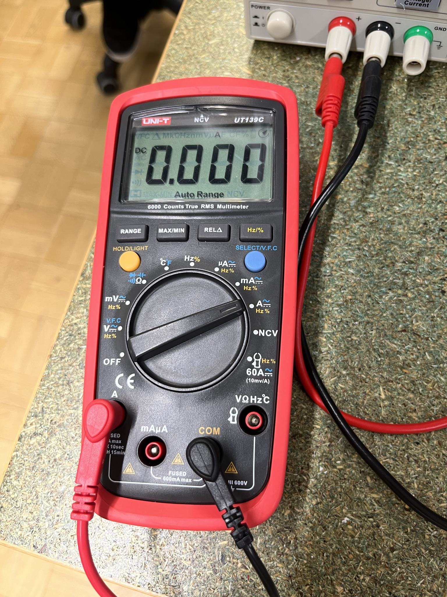
Danach sind wir auch tatsächlich ins Labor gegangen (mittlerweile auch mit coolen Laborkitteln) und haben ein paar Sachen bekommen, die wir dann für die Übungen benöten. Im Bild sieht man ein Breadboard, ein paar Kupferkabel, eine Lötplatine und etwas bleifreies Lötzinn. Zusätzlich hatten wir noch etwas Flussmittel, ein Klammergestell und natürlich auch einen Lötkolben.
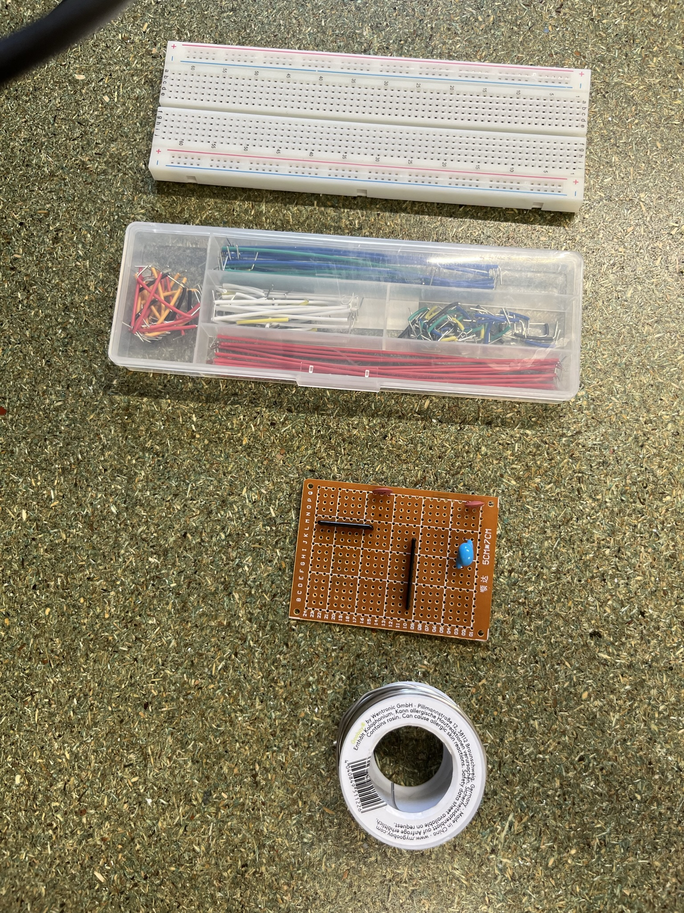
Und hier sehen wir den besagten Lötkolben, den wir brauchen um die Lötstelle ausreichend zu erhitzen und das Lötzinn schmelzen zu lassen. Darunter ist Messingwolle mit dem man den Lötkolben immer wieder mal abputzen sollte damit das Löten weiterhin möglichst reibungsfrei funktioniert.
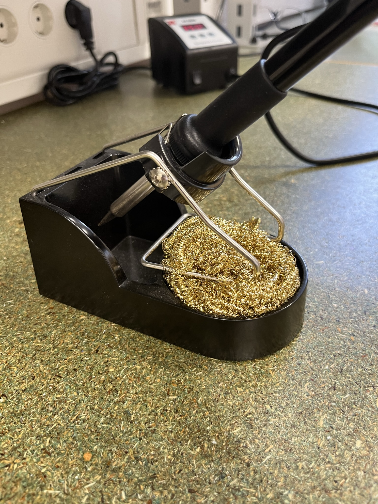
Bevor man lötet sollte man bei der Lötstelle ausreichend Flussmittel verteilen damit das Lötzinn danach besser an der Lötstelle haftet. Dazu schüttelt man erst den Stift, drückt fest auf die Lötplatine bis sich der Stift über das Filz schiebt, damit das Flussmittel austritt und verteilt es dann mit dem Stift großzügig um die Lötstelle herum. Dafür haben wir ein paar Versuche gebraucht, da wir ein bisschen unterschätzt haben wie viel Druck man ausüben sollte um das Flussmittel "rauszuquetschen".
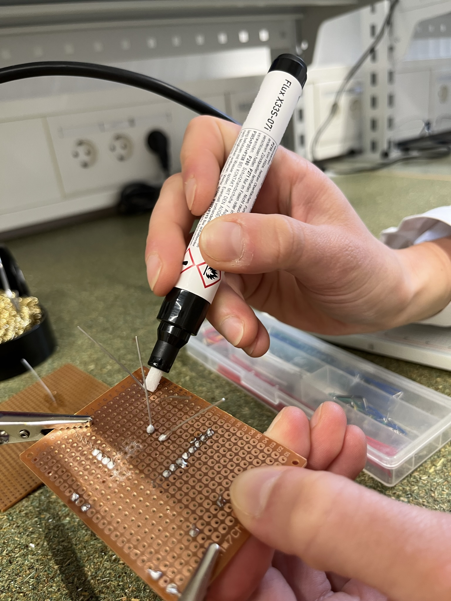
Hier sieht man den Lötkolben in Action als wir die Lötstelle erhitzt haben. Wichtig ist es, dass man sowohl das Bauteil als auch die Platine an der Stelle erhitzt damit das Lötzinn die Stelle danach gut abdeckt.
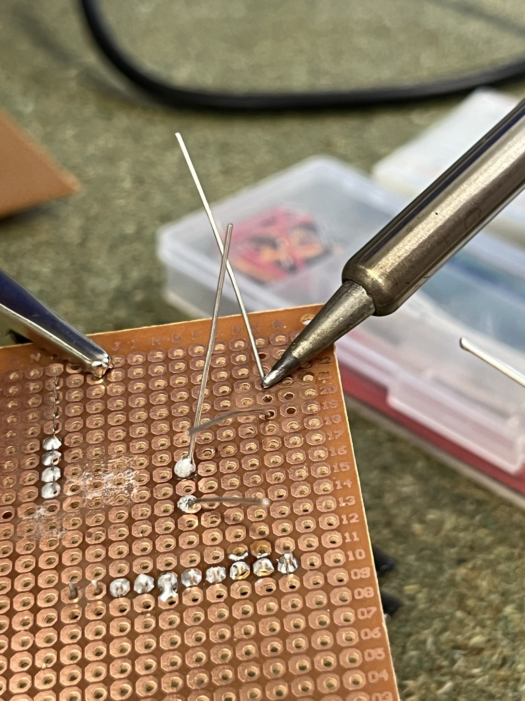
Und hier wird der Lötzinn an die Stelle gehalten und mithilfe des Lötkolbens gleichmäßig verteilt. Die Abschätzung der Dosierung erfordert ein bisschen Übung, weil es nicht zu wenig sein darf, da sonst nicht die ganze Lötstelle benetzt ist, aber es darf auch nicht zu viel sein, weil sich sonst eine Kugel bildet und die später irgendwann abbrechen könnte.
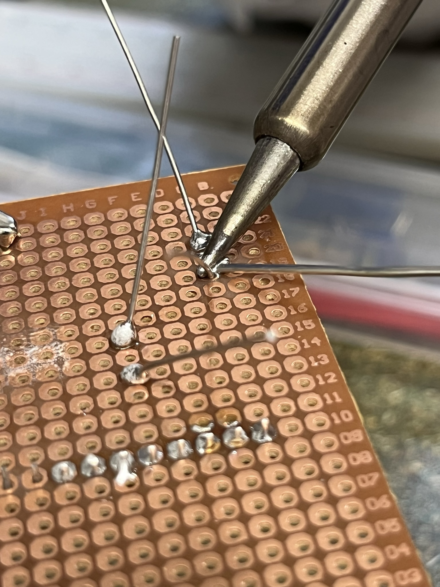
So sieht der Lötversuch aus nachdem das Lötzinn abgekühlt ist. Zugegebermaßen ist es nicht ganz gelungen, weil es ein bisschen ungünstig ist das benachbarte Loch zuzulöten, aber für solche Zwecken haben wir coole Gadgets um sowas zu korrigieren, aber mehr dazu später.
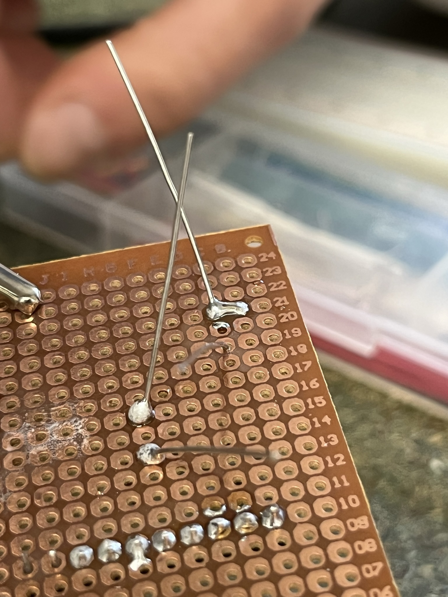
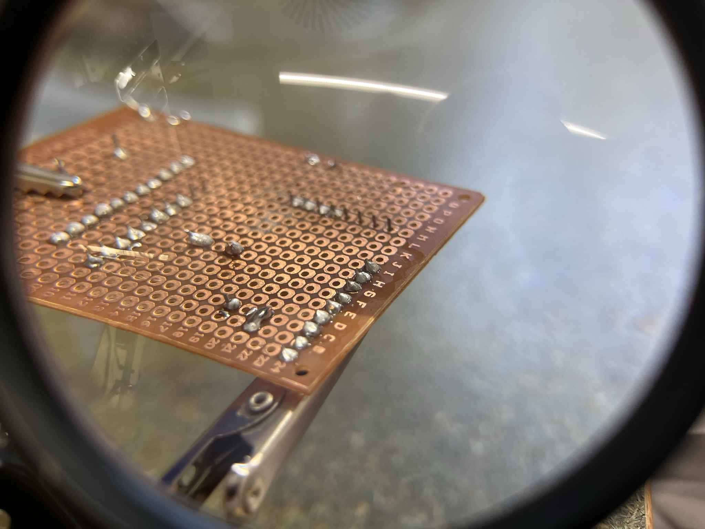
Dieses kupferfarbene Ding links ist sogenanntes Entlötlitz. Wenn man es auf der misslungenen Lötstelle erhitzt "saugt" es den Lötzinn quasi auf. Hinbekommen hab ich das leider nicht, obwohl das bei Johannes ziemlich einfach aussah. Andernfalls kann man ja auch hoffen, dass man es gar nicht erst braucht!
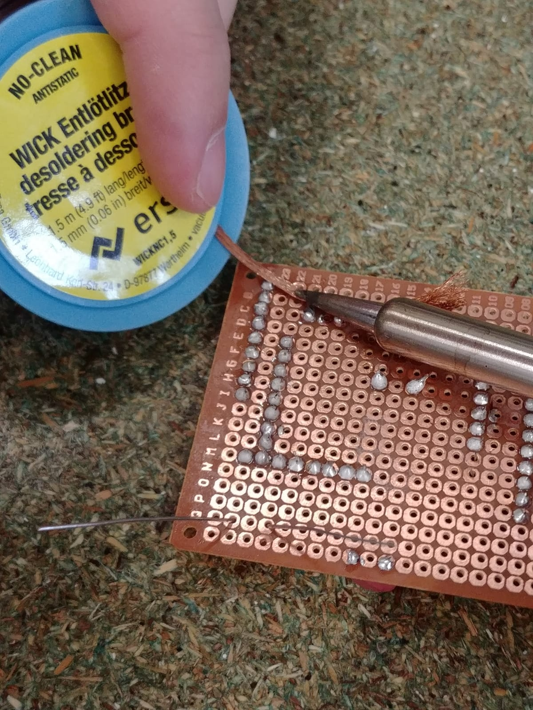
Mithilfe dieses Netzteils kann man die Stromstärke und die Spannung, die ausgegeben wird einstellen, was sich perfekt für Messtechnik-Versuche eignet! Wir haben gelernt wo man den Multimeter dranklammern muss um die Stromstärke oder die Spannung zu messen (wobei man aufpassen muss da dies jeweils andere Stellen sein müssen). Ebenfalls haben wir beispielsweise Widerstände gemessen da wir mit dem Spannungsabfall ausrechnen können wie stark der Widerstand sein muss. Ohm'sche Gesetze sei Dank!
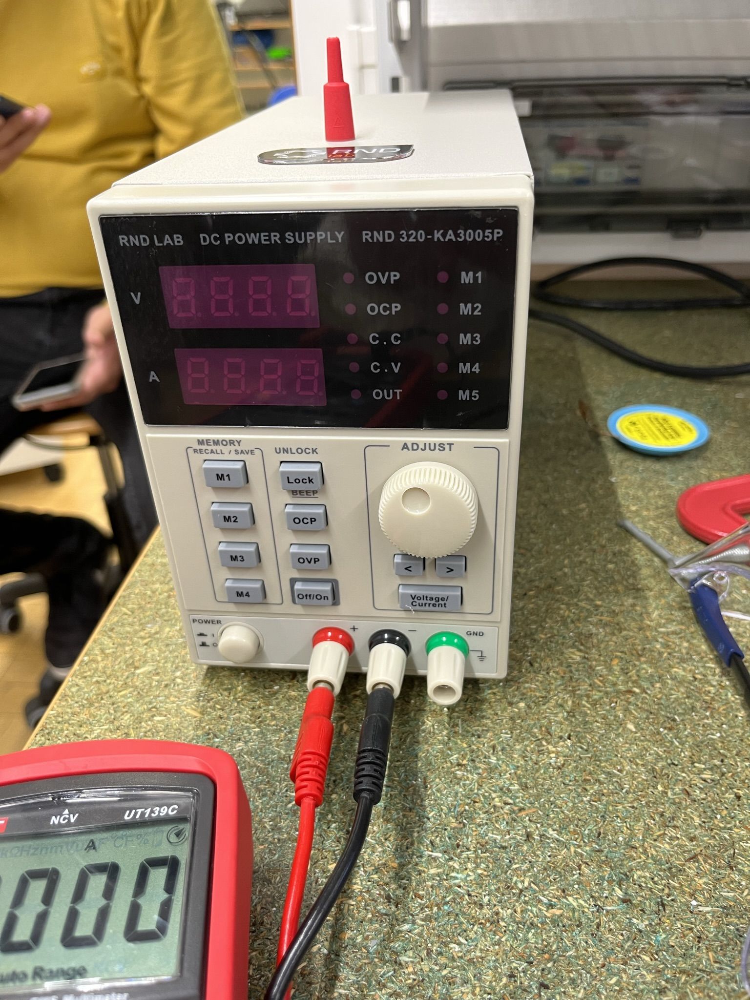
Zur Messung von Stromstärke und Spannung haben wir hier zwei verschiedene Multimeter benutzt. Die beiden linken Klammern messen die Stromstärke und die rechten Klammern messen die Spannung. In der Schaltung befindet sich ein Widerstand und bei dem haben wir versucht mithilfe der Messungen den Widerstandswert zu berechnen wie vorhin erwähnt.
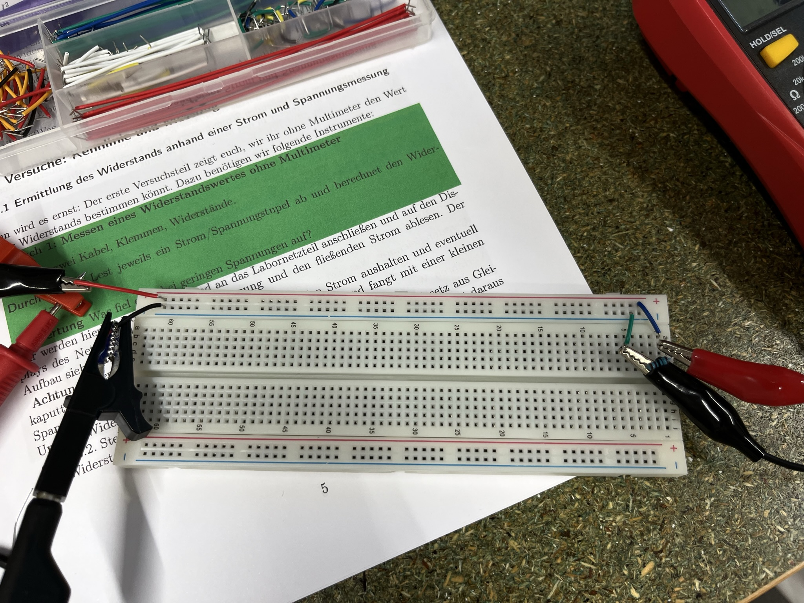
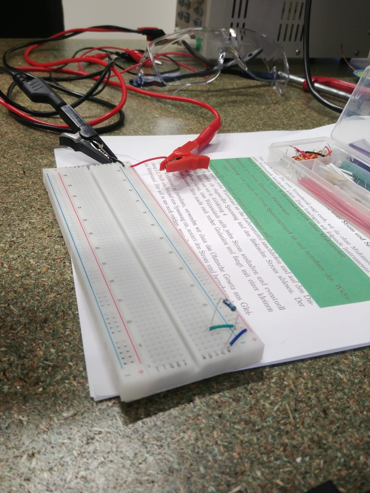
Zum Abschluss des Tages hat uns Johannes die Funktionsweise eines Oszilloskops gezeigt. Mit dem Gerät können wir Spannung über einen zeitlichen Verlauf beobachten oder sogar Snapshots erstellen für besonders spannende Momente. Anhand dessen hat er uns auch den Prelleffekt erklärt, der bei Buttons von besonders großer Bedeutung ist. Beim betätigen der Taste wird der Stromkreis geschlossen, aber das Spannungsniveau schwankt anfangs immer sehr stark bevor der Button endgültig als gedrückt gilt. Hier muss man drauf achten entweder Software- oder Hardware-Lösungen dafür zu verwenden um das zu umgehen.
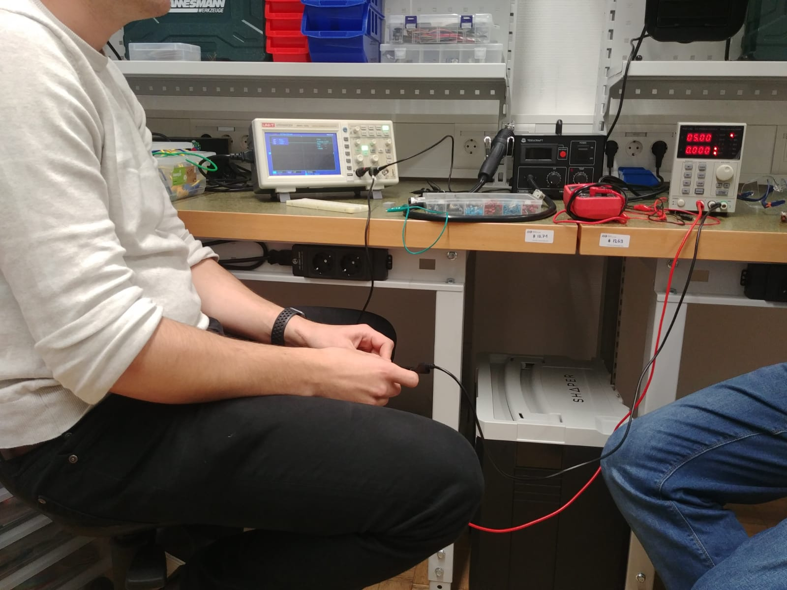

## Was war neu für mich
Neu war bei dem Labor für mich das Flussmittel und das Entlötlitz, das wir in der Schule aus irgendeinem Grund nie verwendet haben um zu Löten. Außerdem musste ich mich nie so intensiv mit dem Messen von Schaltkreisen auseinandersetzen. Ich kannte zwar den Multimeter schon, aber ich wusste nicht, dass man zum Messen von Strom und Spannung verschiedene Messpunkte benötigt, was aber nach dem Hören der Vorlesung sehr viel Sinn macht.

## Die Entscheidung des Projekts
Ich schwankte sehr zwischen Wetterstation und dem RetroPie, aber letztendlich habe ich mich doch für den RetroPie entschieden, weil es am Ende doch das coolere Projekt ist, wenn man es von der Uni abkauft und nach Hause nehmen kann. Außerdem hat man beim Case mehr Möglichkeiten kreativ zu werden und auch ein schönes Design zu entwickeln. Bei der Wetterstation ist das zur Gewährleistung der Funktionsweise ja nur beschränkt möglich.
Zum Abschluss gibt es noch einen groben Schaltplan für das Projekt: 
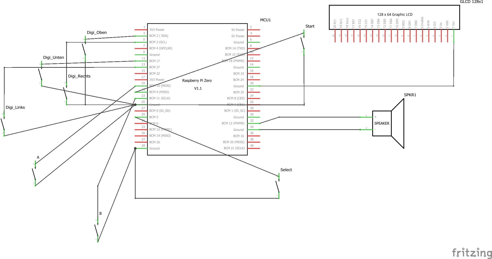
Vielen Dank fürs Lesen des doch etwas lang gewordenen Blog-Eintrags!