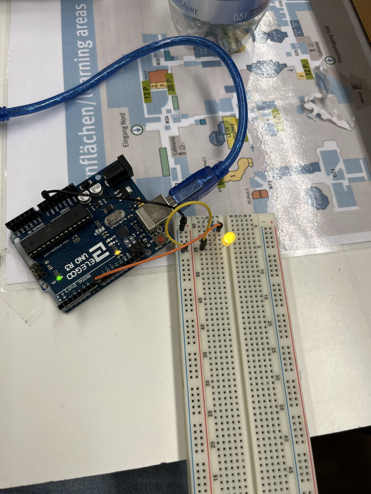
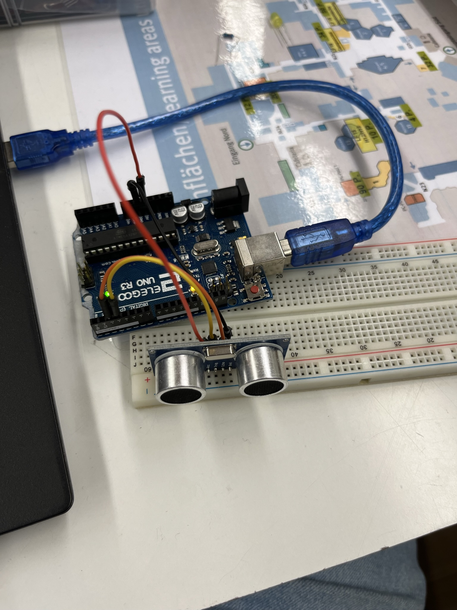
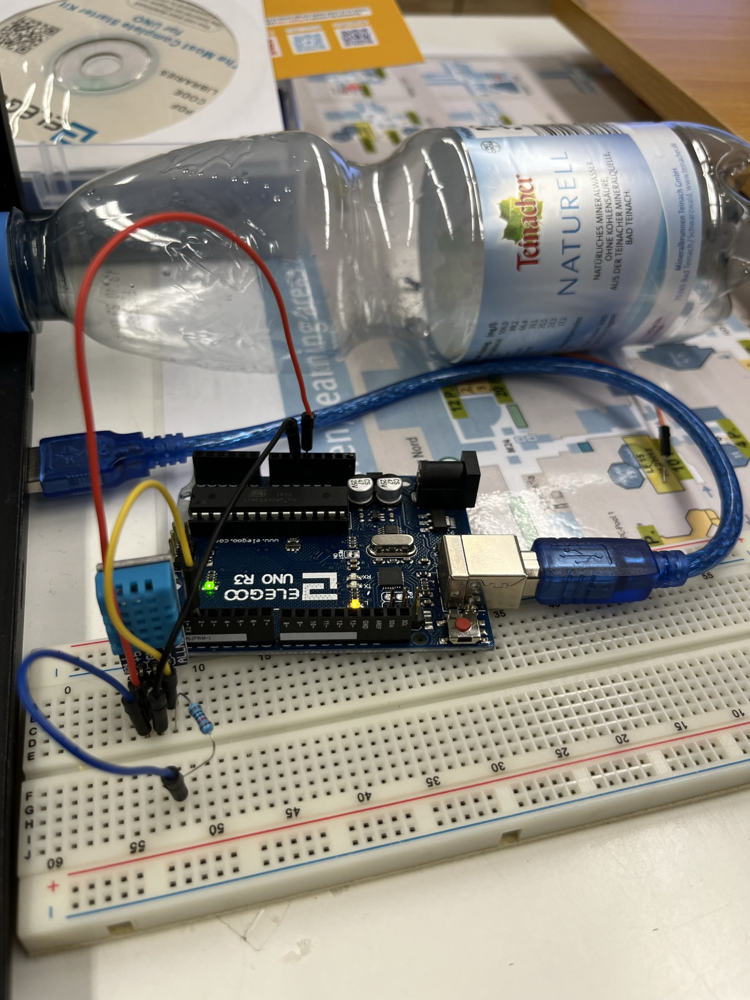
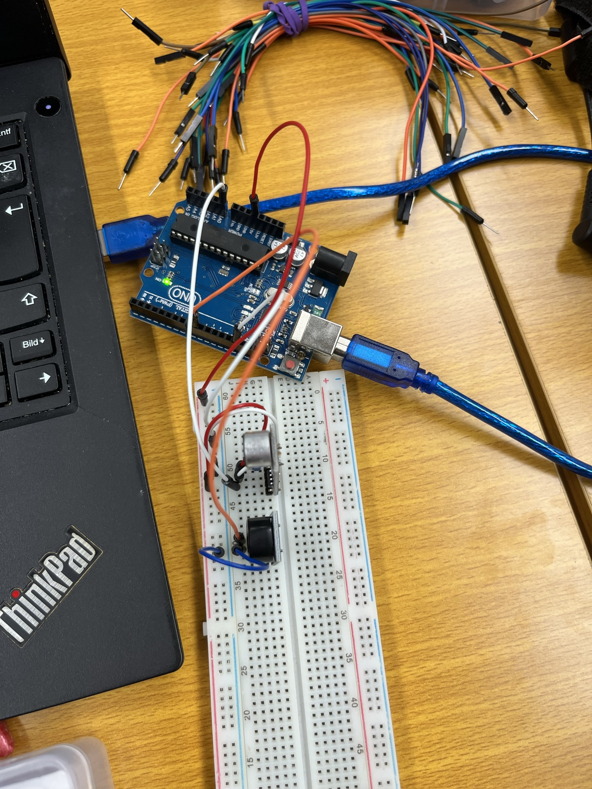
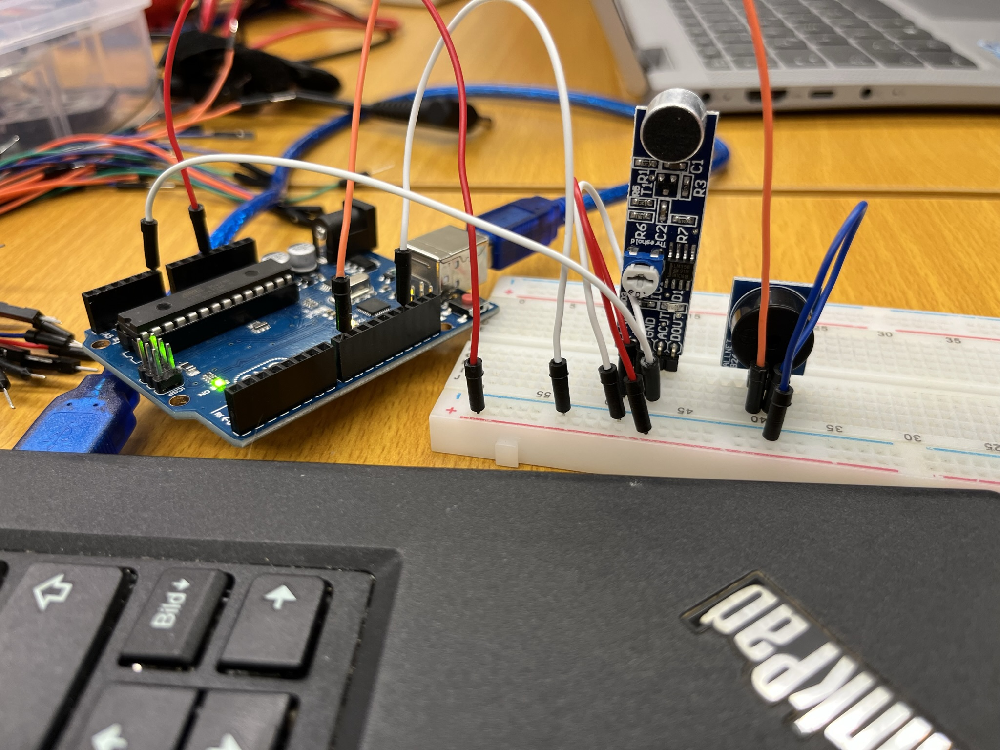
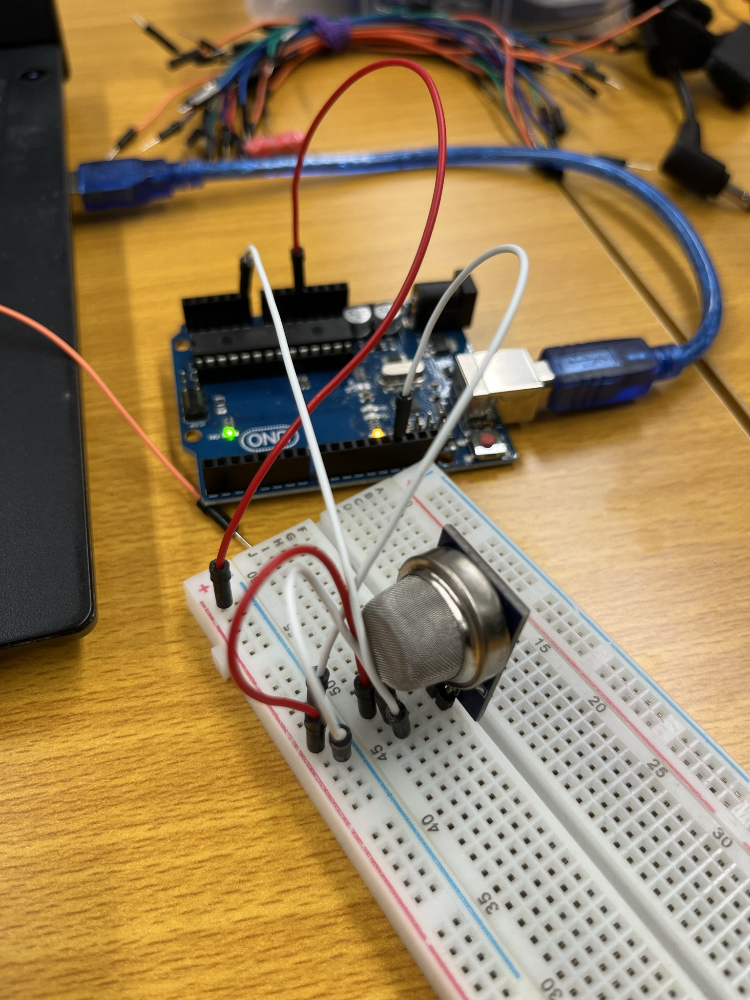
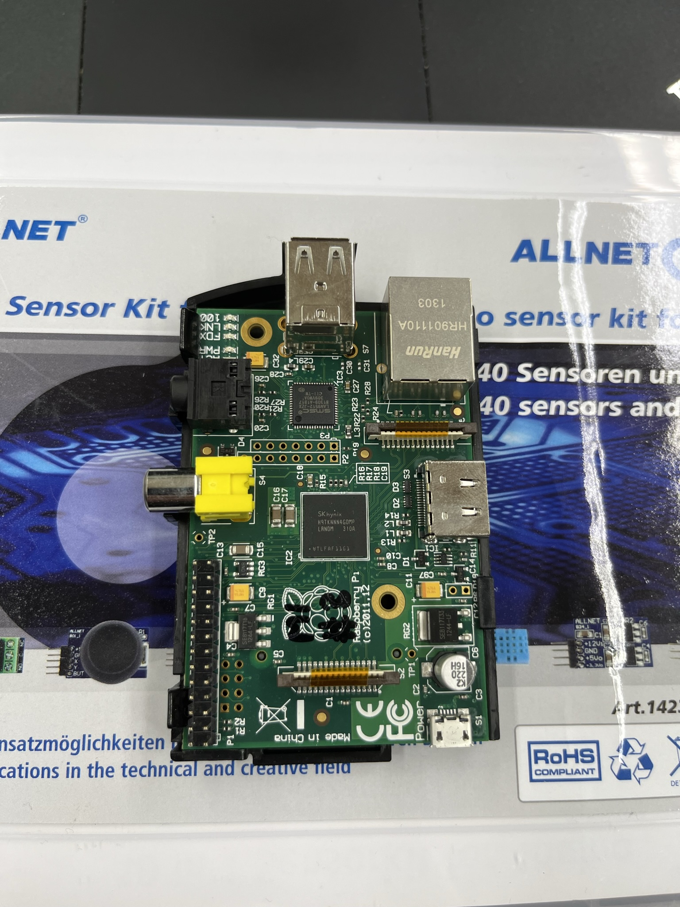
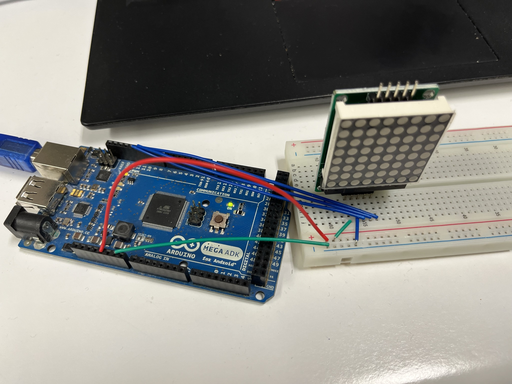

In den Labs habe ich verschiedene Sensoren ausprobiert und teilweise Libraries dazu eingebunden.
Am Anfang mussten wir alle eine LED zum Leuchten bringen, wo man eigentlich nur auf den Widerstand und die Fließrichtung des Stroms achten muss. Je niedriger der Widerstand
umso heller leuchtet die LED, allerdings sinkt dann auch die Lebenszeit.

Danach habe ich mithilfe des Ultraschallsensors die Entfernungen zu verschiedenen Dingen gemessen

